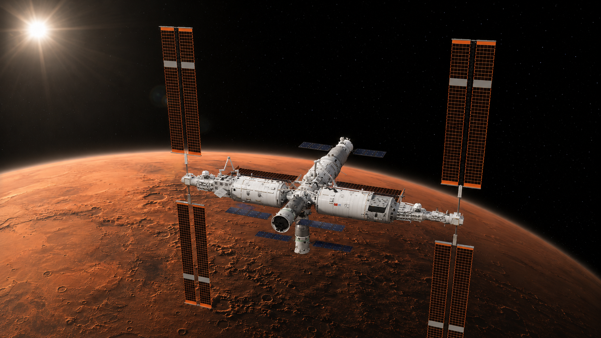

  

<h1 align="center">Going to Mars</h1>

<strong>MATH2850J Honors Mathematics III</strong>

  <strong>English</strong> | <a href="README.zh-CN.md">中文</a>

<em>“We can clasp the moon in the Ninth Heaven 
And seize turtles deep down in the Five Seas: 
We’ll return amid triumphant song and laughter. 
Nothing is hard in this world 
If you dare to scale the heights.”</em> 
<em>— Mao Zedong</em>

<em>“Earth is the cradle of humanity, but mankind cannot remain in the cradle forever.”</em> 
<em>— Konstantin Tsiolkovsky</em>

This repository contains the companion visualization website for the MATH2850J group project **Going to Mars: From Conic Geometry to Transfer Design**. It presents the report's reviewed models, calculations, and figures in both English and Chinese.

- Website: [kimonlu.github.io/MATH2850J-Project-Going-to-Mars-Web](https://kimonlu.github.io/MATH2850J-Project-Going-to-Mars-Web/)
- Repository: [KimonLu/MATH2850J-Project-Going-to-Mars-Web](https://github.com/KimonLu/MATH2850J-Project-Going-to-Mars-Web)

## Project Information

- Course: **MATH2850J Honors Mathematics III**
- Project: **Going to Mars: From Conic Geometry to Transfer Design**
- Instructor: **Professor Horst Hohberger**
- Group: **Group 19**
- Members: **Zhuo Chen, Chenming Tao, Peikai Mao, Kemeng Lu**
- School & College: **SJTU-GC**

## Project Scope

The project develops a single hierarchy of models, from analytic two-body mechanics to date-specific transfer design and gravity-assist geometry.

1. **Keplerian foundations**: derives conic trajectories under an inverse-square central force, ellipse geometry, orbital energy, and the vis-viva equation.
2. **Hohmann transfer benchmark**: constructs the ideal circular-coplanar Earth-Mars transfer and its impulse, flight-time, and energy relations.
3. **Ephemeris-driven Lambert transfer**: compares circular-coplanar, JPL/Standish secular, and NASA/JPL DE440s state models; solves the zero-revolution prograde Lambert problem for the 2026-2027 opportunity; and evaluates porkchop maps, local robustness, and Pareto trade-offs using a patched-conic metric.
4. **Gravity assist**: uses planet-centred hyperbolic fly-by geometry to analyse turning angles, velocity-vector changes, frame-dependent energy exchange, and a Jupiter/Voyager 1 reference reconstruction.

## Principal Result

Within the stated patched-conic model, the recommended minimum-total-impulse Earth-Mars design departs on **2026-11-01 06:00 UTC**, arrives on **2027-09-07 12:00 UTC**, and has a **310.25 day** flight time. Its Earth-departure characteristic energy is **C3 = 9.27 km²/s²** and its two-impulse parking-orbit budget is **5.696 km/s**.

The result is a model-comparison outcome, not a mission-ready trajectory. The reported scope excludes finite burns, launch-site geometry, navigation, spacecraft mass staging, atmospheric entry, and other operational constraints.

## Companion Website

The website is an interactive presentation layer, not the authoritative scientific record. The submitted report and the archived scripts and data in `Project/` define the mathematical assumptions, numerical procedures, and reported results.

The site includes:

- bilingual Chinese/English interfaces;
- orbital and Hohmann-transfer visualizations;
- DE440s-based transfer-window, porkchop, robustness, Pareto, and three-dimensional trajectory views;
- a gravity-assist page with planet-frame hyperbolic geometry, historical encounter presets, and a heliocentric velocity-vector demonstration;
- formula and data-source pages for the models used in the presentation.

## AI Usage Statement

The mathematical modelling and core problem-solving work were completed independently by the group members. AI tools were used as supporting tools for brainstorming, programming, review, and presentation:

- [DeepSeek Chat](https://chat.deepseek.com/)
- [ChatGPT](https://chatgpt.com/)
- [Grok](https://grok.com/)
- [Claude](https://claude.ai/)

All AI-assisted orbital-propagation, numerical-calculation, and visualization code was strictly reviewed by the group members. The frontend code for this companion website was implemented with [Claude Code](https://www.anthropic.com/claude-code) and [OpenAI Codex](https://openai.com/codex/). Frontend implementation is not a core mathematical component of the project; the website serves only as a presentation layer for the independently developed and manually verified models, calculations, and visualizations.
